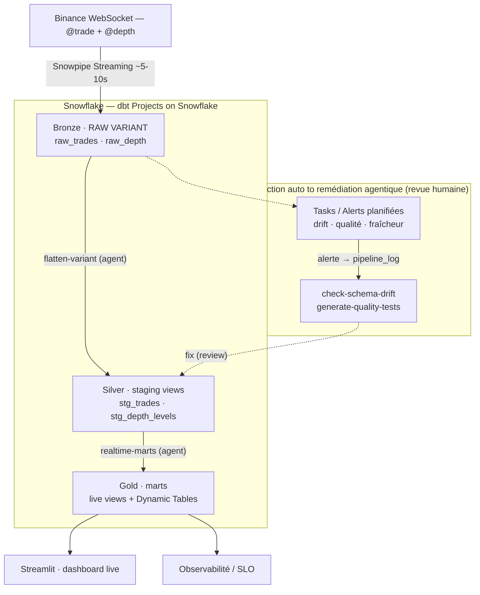

<div align="center">

# 📈 Real-Time Crypto Analytics
### ❄️ Snowflake · 🛠️ dbt · 🤖 Cortex Code

**Pipeline crypto _100 % temps réel_ où un agent IA génère _et maintient_ la couche dbt — sous gouvernance humaine.**


</div>

---

> **En une phrase :** une plateforme d'_agentic data engineering_ de bout en bout — ingestion streaming sub-seconde, modélisation **générée par un agent** depuis du JSON imbriqué brut, **auto-réparation** du schéma, **tests qualité auto-générés**, le tout **mesuré (SLO)** et **encadré** (revue humaine, pas de pilote automatique).

## ✨ Highlights

- 🤖 **Agentic** — la couche dbt (flatten + marts) est **générée par Cortex Code**, pas écrite à la main.
- 🩹 **Self-healing** — un agent détecte la dérive de schéma et **étend les modèles staging tout seul**.
- ✅ **Qualité auto** — un agent génère des **tests métier** (invariants OHLC / order book) — il a même **trouvé un vrai bug**.
- ⚡ **Vrai temps réel** — Snowpipe Streaming + vues calculées à la lecture : **latence p95 ~0,16 s**, **~260 trades/s**.
- 🔭 **Production** — SLO mesurés, monitoring/alertes, **FinOps** (resource monitor), exploitation 24/7.
- 🛡️ **Gouvernance** — détection automatisée → remédiation agentique **validée par un humain avant commit**.

## 🏗️ Architecture



- **Source** : Binance WebSocket — `@trade` (transactions) + `@depth` (carnet d'ordres, JSON imbriqué).
- **Ingestion** : **Snowpipe Streaming** (SDK Python) → tables Bronze en **VARIANT brut**.
- **Modélisation** : **Cortex Code** génère staging → intermediate → marts (dbt Projects on Snowflake).
- **Service** : vues **live** (temps réel) + **Dynamic Tables** (historique) + dashboard **Streamlit**.

Plan détaillé : [`PROJECT_PLAN.md`](./PROJECT_PLAN.md).

## 🤖 Agents & orchestration

Un agent IA natif Snowflake — **Cortex Code (CoCo)** — via **3 skills spécialisés**. Principe :
on **automatise la détection** (SQL planifié), la **remédiation reste agentique sous revue humaine**.

| Skill | Rôle | Déclenchement |
|---|---|---|
| `flatten-variant` (+ `realtime-marts`) | 🏗️ **Build** — VARIANT → staging → marts (vues live + Dynamic Tables) | à la demande |
| `check-schema-drift` | 🩹 **Maintain / self-heal** — détecte les clés/types non mappés, étend le staging (additif) | sur alerte de drift |
| `generate-quality-tests` | ✅ **Quality** — profile les modèles, génère des tests métier (OHLC, order book, RSI) | à la demande / sur échec |

**Orchestration (détection auto → remédiation agentique) :**

| Boucle | Détection auto (Task / Alert) | Signal | Remédiation (agent, revue) |
|---|---|---|---|
| Schéma | `crypto_schema_drift_check` (quotidien) | `pipeline_log` · DRIFT | `check-schema-drift` |
| Qualité | `crypto_dbt_test` (horaire) + `crypto_quality_check` | `pipeline_log` · TEST_FAILED | `generate-quality-tests` / fix |
| Fraîcheur | `crypto_freshness_alert` (5 min) | `pipeline_log` · STALE | vérifier / relancer le consumer |

> 🛡️ **Gouvernance** : on ne « cron » pas l'agent. La détection est automatisée et **déclenche** une intervention agentique **validée par un humain avant commit** (anti « vibe coding »). Auto-réparation **assistée**, pas aveugle.

## 📊 Résultats & SLO

Mesuré en conditions réelles (BTC, ETH, SOL — consumer actif) :

| Métrique | Valeur |
|---|---|
| ⚡ Latence d'ingestion (event → réception), **p95** | **~0,16 s** (moy. ~0,11 s) |
| 🛰️ Latence end-to-end (→ requêtable) | + commit Snowpipe ~5-10 s → **≪ SLO 15 s** |
| 🚀 Débit | **~260 trades/s** (≈ 79 000 / 5 min) |
| 🧱 Modèles dbt | staging → intermediate → marts (vues live + Dynamic Tables) |
| ✅ Tests dbt | **100 % verts** (not_null, unique, accepted_values, invariants) |
| 🤖 Couche de modélisation | **générée par l'agent Cortex Code** |

Requêtes de monitoring : [`snowflake/02_observability.sql`](./snowflake/02_observability.sql).

## 🚀 Quickstart

```bash
# 1. Setup Snowflake (région AWS) — édite snowflake/00_setup.sql, exécute-le dans Snowsight
#    (crée DB, rôle, warehouse, user de service SVC_CRYPTO, tables VARIANT, resource monitor)
openssl genrsa 2048 | openssl pkcs8 -topk8 -inform PEM -out rsa_key.p8 -nocrypt
openssl rsa -in rsa_key.p8 -pubout -out rsa_key.pub   # clé publique -> ALTER USER SVC_CRYPTO ...

# 2. Lancer l'ingestion
cd ingestion && python -m venv venv && source venv/bin/activate
pip install -r requirements.txt
cp profile.json.example profile.json                  # account / user / url + rsa_key.p8
export SYMBOLS="btcusdt,ethusdt,solusdt" DEPTH_LEVEL=20 DEPTH_SPEED=1000ms
python stream_to_snowflake.py

# 3. Générer les modèles (Cortex Code, Snowsight, rôle CRYPTO_PIPELINE_ROLE)
#    $flatten-variant   puis   $realtime-marts     (cf. runbook/cortex_code_prompts.md)

# 4. Dashboard : déployer dashboard/streamlit_app.py en Streamlit in Snowflake
```

<details>
<summary>📁 <b>Structure du repo</b></summary>

```
.
├── snowflake/
│   ├── 00_setup.sql              # bases, rôle, warehouse, user de service, tables VARIANT, resource monitor
│   ├── 02_observability.sql      # requêtes SLO (latence, fraîcheur, débit, lag, dédup, coût)
│   ├── 03_alerts.sql             # monitoring : alerte fraîcheur + task tests dbt
│   ├── 04_drift_detection.sql    # détection auto de dérive de schéma (task quotidienne)
│   └── 05_quality_monitoring.sql # task : log des échecs de tests qualité
├── ingestion/                    # consumer temps réel (ingestion brute, NE flatten pas)
│   ├── stream_to_snowflake.py    #   Binance WS (2 flux) → Snowpipe Streaming → RAW VARIANT
│   ├── requirements.txt · Dockerfile · profile.json.example
├── .cortex/skills/               # skills Cortex Code
│   ├── flatten-variant/          #   build
│   ├── check-schema-drift/       #   self-healing
│   └── generate-quality-tests/   #   qualité
├── AGENTS.md                     # prompts réutilisables ($flatten-variant, $realtime-marts, ...)
├── macros/                       # macros de flatten
├── models/                       # VIDE au départ — GÉNÉRÉ par Cortex Code
├── seeds/dim_symbols.csv
├── dashboard/streamlit_app.py
└── runbook/cortex_code_prompts.md
```

> `models/` est volontairement vide : les modèles sont **produits par l'agent**, pas écrits à la main.
</details>

<details>
<summary>🔧 <b>Production & exploitation</b></summary>

- **Monitoring automatisé** (`03_alerts.sql`) : alerte de fraîcheur + tests dbt horaires (schéma `ANALYTICS.MONITORING`).
- **Rafraîchissement continu** : Snowpipe Streaming + Dynamic Tables (`target_lag='1 minute'`) — pas de cron dans le chemin critique.
- **Hébergement 24/7** du consumer via Docker :
  ```bash
  docker build -t crypto-ingest ./ingestion
  docker run -d --restart=unless-stopped \
    -e SYMBOLS="btcusdt,ethusdt,solusdt" -e DEPTH_SPEED=1000ms \
    -v "$PWD/ingestion/profile.json:/app/profile.json:ro" \
    -v "$PWD/ingestion/rsa_key.p8:/app/rsa_key.p8:ro" \
    crypto-ingest
  ```
- **Reproductibilité** : régénérer → `$flatten-variant` / `$realtime-marts` ; rebuild → `EXECUTE DBT PROJECT ANALYTICS.PUBLIC.crypto_realtime ARGS='build';`.
</details>

<details>
<summary>💸 <b>FinOps — incident réel & résolution</b></summary>

**Symptôme.** `Warehouse 'WH_CRYPTO_XS' cannot be resumed because resource monitor 'RM_CRYPTO' has exceeded its quota`.

**Cause racine.** Quota volontairement bas (1 crédit/jour) dépassé par l'**accumulation de réveils du warehouse** (facturés 60 s mini) : Dynamic Tables en `target_lag='1 minute'` (poste principal) + alerte 5 min + task horaire.

**Détection.** Le **Resource Monitor a joué son rôle** : dépense plafonnée, warehouse suspendu *avant* tout dérapage.

**Résolution.** Quota relevé (`SET CREDIT_QUOTA = 10`) ; `target_lag` élargi (1 → 5 min) ; alerts/tasks suspendus hors démo ; vues live inchangées (coût uniquement à la lecture).

**Leçon.** En streaming, **le monitoring lui-même peut être le 1ᵉʳ poste de coût** — un garde-fou doit être couplé à des cadences raisonnées.
</details>

<details>
<summary>🔐 <b>Sécurité</b></summary>

- Secrets (`profile.json`, `rsa_key.p8`) **jamais commités** (`.gitignore`).
- Rôle least-privilege `CRYPTO_PIPELINE_ROLE` ; user de service `SVC_CRYPTO` (key-pair only) ; Cortex Code respecte le RBAC.
- Revue humaine du code généré par l'agent.
</details>

## 📚 Références

- [Snowpipe Streaming — high-performance (SDK Python)](https://docs.snowflake.com/en/user-guide/snowpipe-streaming-high-performance-overview)
- [Cortex Code](https://docs.snowflake.com/en/user-guide/cortex-code/cortex-code) · [dbt Projects on Snowflake](https://www.snowflake.com/en/blog/building-and-deploying-dbt-projects-on-snowflake-with-cortex-code/)
- 🙏 Skill `flatten-variant` inspiré du repo [`FerAou/Snow_tips`](https://github.com/FerAou/Snow_tips) de Ferhat Aouaghzene.

<div align="center">
<sub>Agentic data engineering · Snowflake + dbt + Cortex Code · temps réel · sous gouvernance</sub>
</div>
