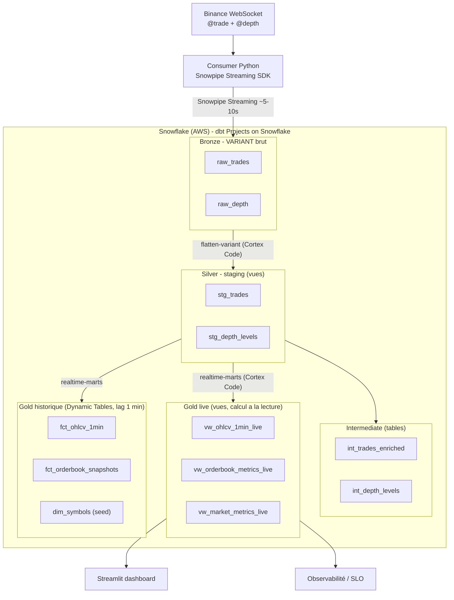
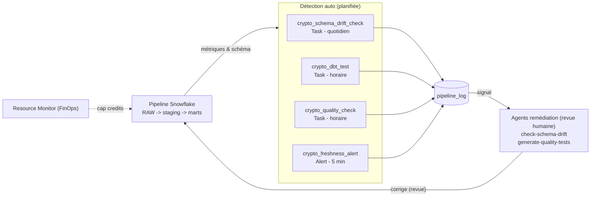
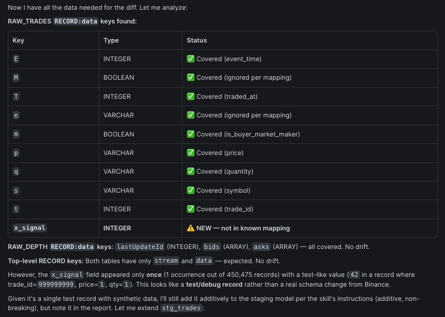
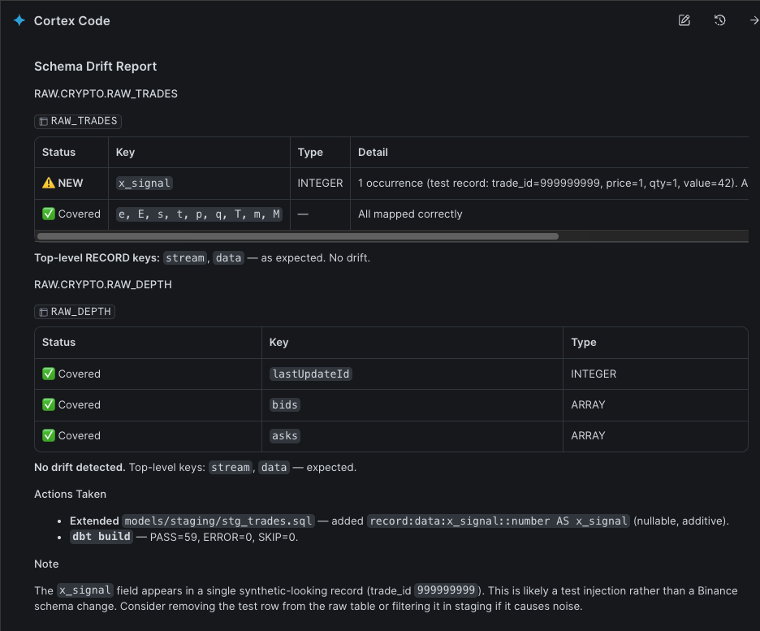
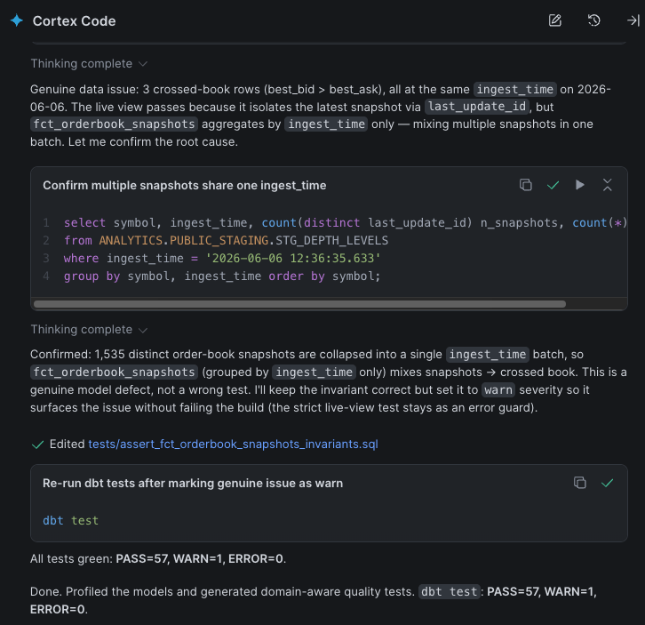
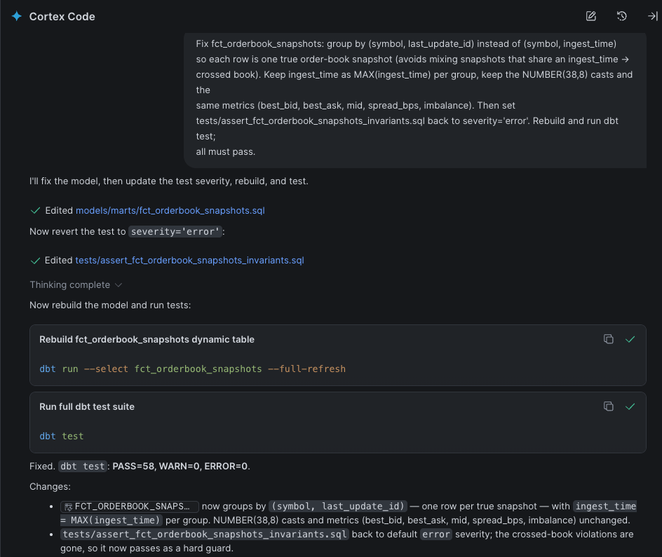
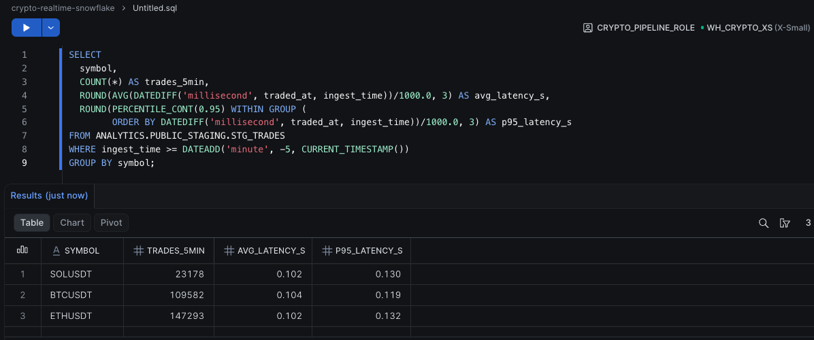
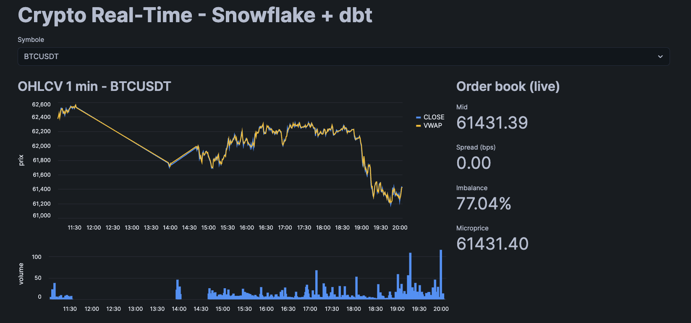

<div align="center">

# Real-Time Crypto Analytics
### Snowflake | dbt | Cortex Code

**Pipeline crypto _100 % temps réel_ où un agent IA génère _et maintient_ la couche dbt, sous gouvernance humaine.**


</div>

---

> **En une phrase :** une plateforme d'_agentic data engineering_ de bout en bout : ingestion streaming sub-seconde, modélisation **générée par un agent** depuis du JSON imbriqué brut, **auto-réparation** du schéma, **tests qualité auto-générés**, le tout **mesuré (SLO)** et **encadré** (revue humaine, pas de pilote automatique).

## Highlights

- **Agentic** : la couche dbt (flatten + marts) est **générée par Cortex Code**, pas écrite à la main.
- **Self-healing** : un agent détecte la dérive de schéma et **étend les modèles staging tout seul**.
- **Qualité auto** : un agent génère des **tests métier** (invariants OHLC / order book) ; il a même **trouvé un vrai bug**.
- **Vrai temps réel** : Snowpipe Streaming + vues calculées à la lecture, **latence p95 ~0,13 s**, **~900 trades/s**.
- **Production** : SLO mesurés, monitoring/alertes, **FinOps** (resource monitor), exploitation 24/7.
- **Gouvernance** : détection automatisée, remédiation agentique **validée par un humain avant commit**.

## Architecture

### Pipeline de données (medallion)



### Gouvernance & orchestration



- **Source** : Binance WebSocket, `@trade` (transactions) + `@depth` (carnet d'ordres, JSON imbriqué).
- **Ingestion** : **Snowpipe Streaming** (SDK Python) -> tables Bronze en **VARIANT brut**.
- **Modélisation** : **Cortex Code** génère staging -> intermediate -> marts (dbt Projects on Snowflake).
- **Service** : vues **live** (temps réel) + historique en **incrémental** (et 1 Dynamic Table) + dashboard **Streamlit**.
- **Matérialisations** : staging & intermediate = **vues** (zéro stockage) ; faits append-only = **incremental** (merge) ; OHLCV historique = incremental (pas Dynamic Table, car `min_by`/`max_by` ne sont pas incrémentalement maintenables).

**Sémantique temporelle (choix assumé).** Les fenêtres temps réel utilisent l'**event-time** (`traded_at`) pour les trades, et l'**ingest-time** (`ingest_time`) pour le carnet d'ordres — le partial book depth Binance n'a pas d'horodatage d'événement propre. Les filtres comparent à `sysdate()` (UTC, `TIMESTAMP_NTZ`) et non `current_timestamp()` (LTZ), pour ne pas décaler la fenêtre selon le fuseau de session.

Plan détaillé : [`PROJECT_PLAN.md`](./PROJECT_PLAN.md).

## Agents & orchestration

Un agent IA natif Snowflake, **Cortex Code (CoCo)**, via **3 skills spécialisés**. Principe :
on **automatise la détection** (SQL planifié), la **remédiation reste agentique sous revue humaine**.

| Skill | Rôle | Déclenchement |
|---|---|---|
| `flatten-variant` (+ `realtime-marts`) | **Build** : VARIANT -> staging -> marts (vues live + Dynamic Tables) | à la demande |
| `check-schema-drift` | **Maintain / self-heal** : détecte les clés/types non mappés, étend le staging (additif) | sur alerte de drift |
| `generate-quality-tests` | **Quality** : profile les modèles, génère des tests métier (OHLC, order book, RSI) | à la demande / sur échec |

**Orchestration (détection auto -> remédiation agentique) :**

| Boucle | Détection auto (Task / Alert) | Signal | Remédiation (agent, revue) |
|---|---|---|---|
| Schéma | `crypto_schema_drift_check` (quotidien) | `pipeline_log` (DRIFT) | `check-schema-drift` |
| Qualité | `crypto_dbt_test` (horaire) + `crypto_quality_check` | `pipeline_log` (TEST_FAILED) | `generate-quality-tests` / fix |
| Fraîcheur | `crypto_freshness_alert` (5 min) | `pipeline_log` (STALE) | vérifier / relancer le consumer |

> **Gouvernance** : on ne « cron » pas l'agent. La détection est automatisée et **déclenche** une intervention agentique **validée par un humain avant commit** (anti « vibe coding »). Auto-réparation **assistée**, pas aveugle.

## Résultats & SLO

Mesuré en conditions réelles (BTC, ETH, SOL ; consumer actif) :

| Métrique | Valeur |
|---|---|
| Latence d'ingestion (event -> réception), **p95** | **~0,13 s** (moy. ~0,10 s) |
| Latence end-to-end (-> requêtable) | + commit Snowpipe ~5-10 s, bien sous le SLO de 15 s |
| Débit | **~900 trades/s** (~280 000 / 5 min) |
| Modèles dbt | staging -> intermediate -> marts (vues live + Dynamic Tables) |
| Tests dbt | **100 % verts** (not_null, unique, accepted_values, invariants) |
| Couche de modélisation | **générée par l'agent Cortex Code** |

Requêtes de monitoring : [`snowflake/02_observability.sql`](./snowflake/02_observability.sql).

## Démo

### Self-healing : l'agent détecte une nouvelle clé et répare le staging

| Détection | Auto-réparation |
|---|---|
|  |  |

L'agent repère `x_signal` (clé non mappée dans le VARIANT), l'ajoute au staging en **additif**, et rebuild en vert : le flatten se répare tout seul.

### Qualité sous gouvernance : un test généré attrape un vrai bug

| Diagnostic | Correction |
|---|---|
|  |  |

Un test **auto-généré** détecte un carnet d'ordres croisé (`best_bid > best_ask`). L'agent diagnostique la cause racine, **signale pour revue humaine**, puis corrige : tests verts au niveau `error`.

### Temps réel & SLO : latence d'ingestion mesurée



Latence event Binance -> réception : **moyenne ~0,10 s, p95 ~0,13 s** sur **~900 trades/s** (BTC / ETH / SOL), bien en dessous du SLO de 15 s.

### Service temps réel : dashboard Streamlit (in Snowflake)



OHLCV 1 min (close / VWAP), métriques d'order book (mid, spread, imbalance, microprice) et top movers, rafraîchis en continu sur les vues live (Snowpipe Streaming).

## Quickstart

```bash
# 1. Setup Snowflake (region AWS) : edite snowflake/00_setup.sql, execute-le dans Snowsight
#    (cree DB, role, warehouse, user de service SVC_CRYPTO, tables VARIANT, resource monitor)
openssl genrsa 2048 | openssl pkcs8 -topk8 -inform PEM -out rsa_key.p8 -nocrypt
openssl rsa -in rsa_key.p8 -pubout -out rsa_key.pub   # cle publique -> ALTER USER SVC_CRYPTO ...

# 2. Lancer l'ingestion
cd ingestion && python -m venv venv && source venv/bin/activate
pip install -r requirements.txt
cp profile.json.example profile.json                  # account / user / url + rsa_key.p8
export SYMBOLS="btcusdt,ethusdt,solusdt" DEPTH_LEVEL=20 DEPTH_SPEED=1000ms
python stream_to_snowflake.py

# 3. Generer les modeles (Cortex Code, Snowsight, role CRYPTO_PIPELINE_ROLE)
#    $flatten-variant   puis   $realtime-marts     (cf. runbook/cortex_code_prompts.md)

# 4. Dashboard : deployer dash/streamlit_app.py en Streamlit in Snowflake
```

<details>
<summary><b>Variables d'environnement (consumer)</b></summary>

Toutes optionnelles ; les knobs de backpressure ont des défauts sains et ne se touchent que sous forte charge.

| Variable | Défaut | Rôle |
|---|---|---|
| `SYMBOLS` | `btcusdt,ethusdt,solusdt` | Paires Binance à suivre (séparées par des virgules) |
| `DEPTH_LEVEL` | `20` | Niveaux du carnet d'ordres (5 / 10 / 20) |
| `DEPTH_SPEED` | `1000ms` | Cadence du flux depth (1000ms = moins de volume = moins cher) |
| `QUEUE_MAXSIZE` | `100000` | Taille de la file de découplage WS -> writer ; au-delà, perte explicite comptée (`dropped`) |
| `BATCH_MAX_ROWS` | `5000` | Lignes max coalescées par micro-batch du writer |
| `BATCH_MAX_SECONDS` | `1.0` | Borne temps d'un micro-batch (pas de latence ajoutée à faible charge) |
| `SNOWFLAKE_DATABASE` | `RAW` | Base cible de l'ingestion brute |
| `SNOWFLAKE_SCHEMA` | `CRYPTO` | Schéma cible |
| `SNOWFLAKE_PROFILE_JSON` | `profile.json` | Chemin du profil key-pair (jamais commité) |

> Architecture résiliente : le thread WebSocket ne fait aucune I/O Snowflake ; il pousse dans une `queue.Queue` bornée qu'un thread writer draine en micro-batch. La cadence de flush réseau vers Snowflake reste gouvernée par le SDK (`MAX_CLIENT_LAG`).
</details>

<details>
<summary><b>Structure du repo</b></summary>

```
.
├── snowflake/
│   ├── 00_setup.sql              # bases, role, warehouse, user de service, tables VARIANT, resource monitor
│   ├── 02_observability.sql      # requetes SLO (latence, fraicheur, debit, lag, dedup, cout)
│   ├── 03_alerts.sql             # monitoring : alerte fraicheur + task tests dbt
│   ├── 04_drift_detection.sql    # detection auto de derive de schema (task quotidienne)
│   ├── 05_quality_monitoring.sql # task : log des echecs de tests qualite
│   ├── 06_ci_setup.sql           # environnement CI isole (ANALYTICS_CI, role, user de service)
│   ├── 07_ml_anomaly.sql         # surveillance : detection d'anomalies (Cortex ML) + alerte
│   └── 08_raw_retention.sql      # purge RAW (borne le scan) - RAW = buffer, historique dans ANALYTICS
├── ingestion/                    # consumer temps reel (ingestion brute, NE flatten pas)
│   ├── stream_to_snowflake.py    #   Binance WS (2 flux) -> file bornee -> Snowpipe Streaming -> RAW VARIANT
│   ├── requirements.txt / Dockerfile / profile.json.example
│   └── tests/test_consumer.py    #   tests unitaires consumer (pytest) : routage, backpressure, horodatage
├── .cortex/skills/               # skills Cortex Code
│   ├── flatten-variant/          #   build (structure + doc + tests de cles)
│   ├── check-schema-drift/       #   self-healing
│   └── generate-quality-tests/   #   qualite (tests metier + unit tests)
├── .github/workflows/ci.yml      # CI/CD : lint + build/test (base CI isolee) -> deploy prod
├── .sqlfluff                     # regles de lint SQL (conventions du repo)
├── requirements-dev.txt          # outils dev/CI (sqlfluff) - distinct du runtime consumer
├── profiles.yml                  # targets dbt : dev / prod / ci (sans secret)
├── AGENTS.md                     # prompts reutilisables ($flatten-variant, $realtime-marts, ...)
├── models/                       # GENERE par Cortex Code (flatten + marts)
├── tests/                        # tests qualite (singular) - skill generate-quality-tests
├── seeds/dim_symbols.csv
├── dash/streamlit_app.py
└── runbook/cortex_code_prompts.md
```

> Les modèles de `models/` sont **produits par l'agent** (Cortex Code, `$flatten-variant`), pas écrits à la main, puis versionnés et testés (unit tests + tests métier).
</details>

<details>
<summary><b>Production & exploitation</b></summary>

- **Monitoring automatisé** (`03_alerts.sql`) : alerte de fraîcheur + tests dbt horaires (schéma `ANALYTICS.MONITORING`).
- **Rafraîchissement continu** : Snowpipe Streaming + Dynamic Tables (`target_lag='1 minute'`), pas de cron dans le chemin critique.
- **Rétention RAW** (`08_raw_retention.sql`) : purge quotidienne de RAW > 7 jours. RAW est un **buffer** ; l'historique long terme vit dans les marts incrémentaux (`ANALYTICS`). Borne le volume scanné par le dedup de `stg_trades` (sinon le scan grossit sans fin).
- **Hébergement 24/7** du consumer via Docker :
  ```bash
  docker build -t crypto-ingest ./ingestion
  docker run -d --restart=unless-stopped \
    -e SYMBOLS="btcusdt,ethusdt,solusdt" -e DEPTH_SPEED=1000ms \
    -v "$PWD/ingestion/profile.json:/app/profile.json:ro" \
    -v "$PWD/ingestion/rsa_key.p8:/app/rsa_key.p8:ro" \
    crypto-ingest
  ```
- **Reproductibilité** : régénérer -> `$flatten-variant` / `$realtime-marts` ; rebuild -> `EXECUTE DBT PROJECT ANALYTICS.PUBLIC.crypto_realtime ARGS='build';`.
</details>

<details>
<summary><b>Surveillance : détection d'anomalies (Cortex ML)</b></summary>

Au lieu d'afficher des chiffres bruts, le pipeline **surveille** : un modèle `SNOWFLAKE.ML.ANOMALY_DETECTION` (`07_ml_anomaly.sql`) apprend le volume normal par symbole et flague ce qui en sort - avec intervalle de confiance.

- **Features** : le mart `FCT_OHLCV_1MIN` (volume / minute / symbole), en multi-séries (un sous-modèle par symbole).
- **Entraînement / scoring disjoints** : le modèle s'entraîne jusqu'à `now-2h` et score `[now-2h, now]` (contrainte Snowflake : la détection ne porte que sur des timestamps postérieurs à l'entraînement).
- **Sortie** : `ANALYTICS.MONITORING.MART_VOLUME_ANOMALIES` (observé, attendu, bornes de confiance, `is_anomaly`, `distance`).
- **Orchestration** : ré-entraînement horaire + scoring toutes les 15 min (tasks), + une **alerte** quand une anomalie récente apparaît.
- **Sensibilité** : `prediction_interval` (0.99 = prudent pour la prod ; plus bas = plus sensible).
- **Consommateurs** : l'**alerte** (notification) et le **dashboard** (panneaux *anomalies* + *santé pipeline*).

C'est ce qui distingue ce modèle entraîné (tendance, saisonnalité, intervalle de confiance) du z-score live naïf de `VW_MARKET_METRICS_LIVE` (seuil fixe). Anomalie réelle détectée en test : l'effondrement du volume quand le flux s'arrête (la source "meurt").

> La couche se suspend hors démo (tasks/alerte en `SUSPEND`) ; elle ne produit des anomalies live que si le consumer tourne en continu.
</details>

<details>
<summary><b>CI/CD (GitHub Actions, tout-Snowflake)</b></summary>

L'agent (Cortex Code + skills) **écrit** les modèles ; la CI les **valide** avant merge. C'est le garde-fou anti « vibe-coding » : le skill encode l'intention, la CI prouve qu'elle est respectée.

- **Sur Pull Request** (`.github/workflows/ci.yml`) : `sqlfluff lint` (SQL) + `ruff`/`pytest` (consumer Python) + `snow dbt deploy` / `snow dbt execute build` dans une **base CI isolée** (`ANALYTICS_CI`, rôle `CRYPTO_CI_ROLE`, lecture seule sur `RAW`). Un échec **bloque** la PR ; une PR ne peut jamais écrire en prod.
- **Sur merge vers `main`** : déploiement prod (`snow dbt` natif), protégeable par un environment GitHub à reviewers obligatoires.
- **Moteur** : 100 % natif via Snowflake CLI (`snow dbt`), aucun dbt Core à maintenir.
- **Boucle agentique** : si la CI casse, on redonne l'erreur à Cortex Code (skills `check-schema-drift` / `generate-quality-tests`, qui buildent « jusqu'au vert »). L'agent est auteur **et** réparateur, jamais juge.

Setup : exécuter `snowflake/06_ci_setup.sql`, puis renseigner les secrets GitHub :

| Secret | Usage |
|---|---|
| `SNOWFLAKE_ACCOUNT` | Identifiant de compte |
| `SNOWFLAKE_CI_USER` | `SVC_CRYPTO_CI` (validation des PR) |
| `SNOWFLAKE_CI_PRIVATE_KEY_RAW` | Clé privée RSA du user CI (contenu du `.p8`) |
| `SNOWFLAKE_PROD_USER` | `SVC_CRYPTO` (déploiement prod) |
| `SNOWFLAKE_PROD_PRIVATE_KEY_RAW` | Clé privée RSA du user prod |

> Aucune clé privée dans le repo : elles vivent uniquement dans GitHub Secrets ; `profiles.yml` ne contient aucun secret.
</details>

<details>
<summary><b>FinOps : incident réel & résolution</b></summary>

**Symptôme.** `Warehouse 'WH_CRYPTO_XS' cannot be resumed because resource monitor 'RM_CRYPTO' has exceeded its quota`.

**Cause racine.** Quota volontairement bas (1 crédit/jour) dépassé par l'**accumulation de réveils du warehouse** (facturés 60 s mini) : Dynamic Tables en `target_lag='1 minute'` (poste principal) + alerte 5 min + task horaire.

**Détection.** Le **Resource Monitor a joué son rôle** : dépense plafonnée, warehouse suspendu avant tout dérapage.

**Résolution.** Quota relevé (`SET CREDIT_QUOTA = 10`) ; `target_lag` élargi (1 -> 5 min) ; alerts/tasks suspendus hors démo ; vues live inchangées (coût uniquement à la lecture).

**Leçon.** En streaming, **le monitoring lui-même peut être le 1er poste de coût** ; un garde-fou doit être couplé à des cadences raisonnées.
</details>

<details>
<summary><b>Sécurité</b></summary>

- Secrets (`profile.json`, `rsa_key.p8`) **jamais commités** (`.gitignore`).
- Rôle least-privilege `CRYPTO_PIPELINE_ROLE` ; user de service `SVC_CRYPTO` (key-pair only) ; Cortex Code respecte le RBAC.
- Revue humaine du code généré par l'agent.
</details>

## Références

- [Snowpipe Streaming, high-performance (SDK Python)](https://docs.snowflake.com/en/user-guide/snowpipe-streaming-high-performance-overview)
- [Cortex Code](https://docs.snowflake.com/en/user-guide/cortex-code/cortex-code) | [dbt Projects on Snowflake](https://www.snowflake.com/en/blog/building-and-deploying-dbt-projects-on-snowflake-with-cortex-code/)
- Skill `flatten-variant` inspiré du repo [`FerAou/Snow_tips`](https://github.com/FerAou/Snow_tips) de Ferhat Aouaghzene.

<div align="center">
<sub>Agentic data engineering | Snowflake + dbt + Cortex Code | temps réel | sous gouvernance</sub>
</div>
